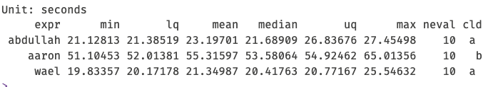
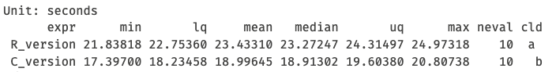

# Summary


# About

In this file, I will write what I have done in the repo in the past few
days.

# Changes

- I have changed the folder structure so functions are defined in
  different folders rather than being written inside the model script.

``` r
fs::dir_tree()
```

    .
    ├── C_model_profiling.Rprofvis
    ├── LICENSE
    ├── README.html
    ├── README.md
    ├── R_model_profiling.Rprofvis
    ├── Summary.qmd
    ├── Summary.rmarkdown
    ├── cpp_functions
    │   ├── gompertz_eventC.cpp
    │   ├── logistic_eventC.cpp
    │   └── weibull_eventC.cpp
    ├── data
    │   ├── population.csv
    │   └── ukpds_coef.csv
    ├── docs
    │   └── micro_sim_development_timeline_2025_01_30.xlsx
    ├── functions
    │   ├── gompertz_event2.R
    │   ├── logistic_event2.R
    │   ├── mortality2.R
    │   ├── mortalityC.R
    │   ├── run_microsim_model.R
    │   ├── run_microsim_modelC.R
    │   ├── update_biomarkers2.R
    │   ├── update_health_events2.R
    │   ├── update_health_eventsC.R
    │   └── weibull_event2.R
    ├── images
    │   ├── clipboard-1789819522.png
    │   └── clipboard-3384987763.png
    ├── microsim_tutorial.Rproj
    └── scripts
        ├── UKPDS_one_at_time_model.R
        ├── UKPDS_vectorized_model_aaron.R
        ├── UKPDS_vectorized_model_abdullah.R
        ├── UKPDS_vectorized_model_wael.R
        └── test_individual_cpp_funs.R

- Inside the `scripts` folder, I created separate .R files for each “R
  version” of the model (Aaron’s, Wael’s and mine). I also created a
  folder called `functions` that stores my modified R functions with
  suffix `2`
- I compared the performance of the three models and the results are
  shown in the image below



- I created cpp functions and stored them inside the `cpp_functions`
  folder. I checked their numeric consistency with their R counterparts
  and they are consistent. I did not convert all functions since the
  rest of the functions are dependent on only these three functions:
  `gompertz_event`, `logisitic_event`, and `weibull_event`.
- I ran some benchmarks in `scripts/test_individual_cpp_funs.R`
- I created a function called `run_microsim_model()` and
  `run_microsim_modelC()` to run the pure R version and Rcpp version,
  respectively.
- Finally, to run my work, you will need to run
  `scripts/UKPDS_vectorized_model_abdullah.R`

# Findings and issues

- I checked the speed performance of the individual Rcpp functions I
  created and found significant improvements in speed (See
  `scripts/test_individual_cpp_funs.R` )

- I checked the numeric consistecny between the R and Rcpp models in
  `scripts/UKPDS_vectorized_model_abdullah.R` in terms of events and
  death, and the numbers match.

- What was really strange to me is the modest improvement I found when I
  compared the performance of `run_microsim_model()` and
  `run_microsim_modelC()`. I couldn’t explain the issue, and I believe I
  would need help with this.

  

- You will find two `.Rprofvis` files for diagnostics.
